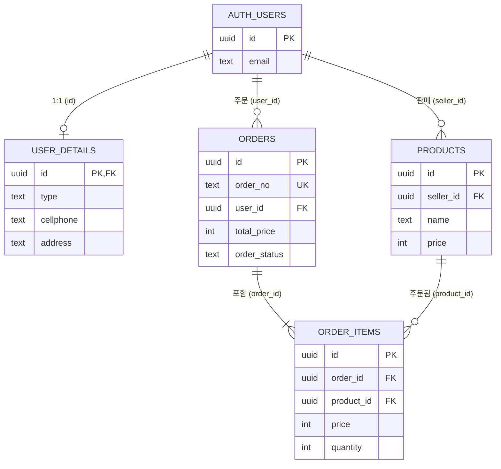
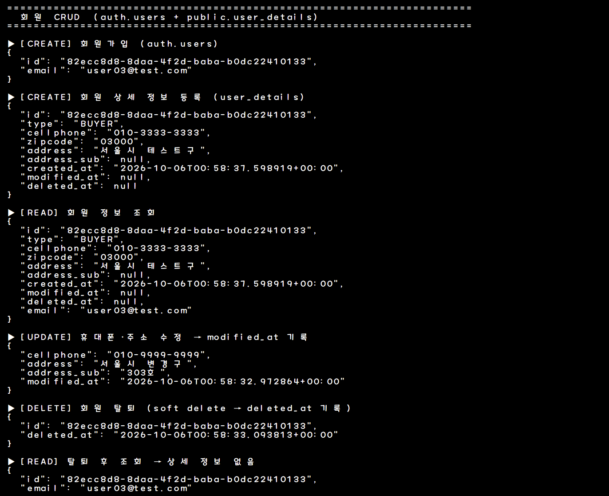
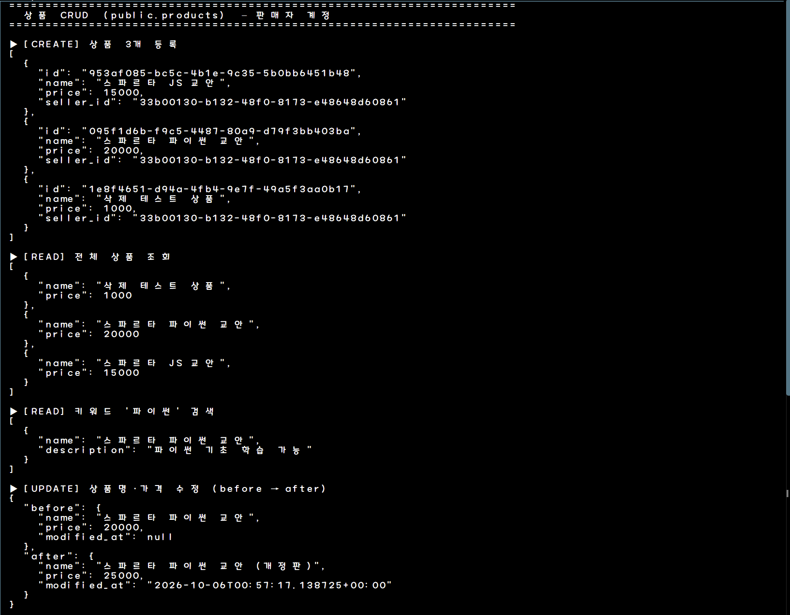
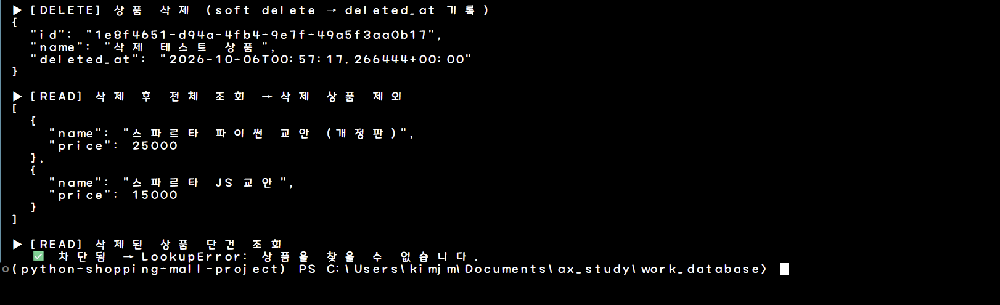
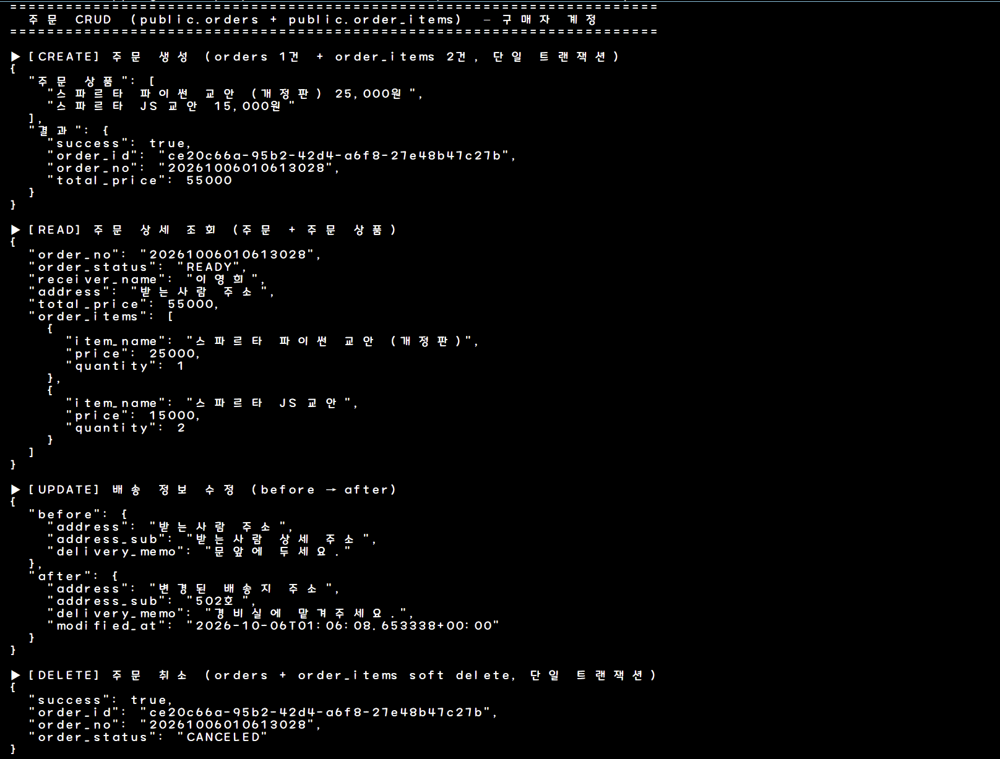
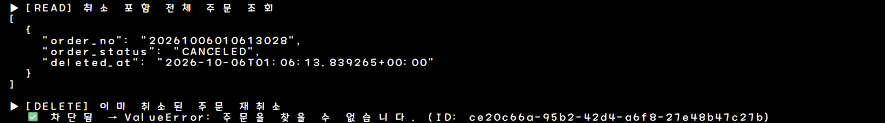
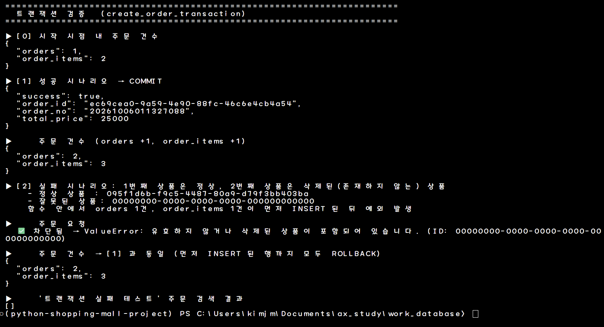
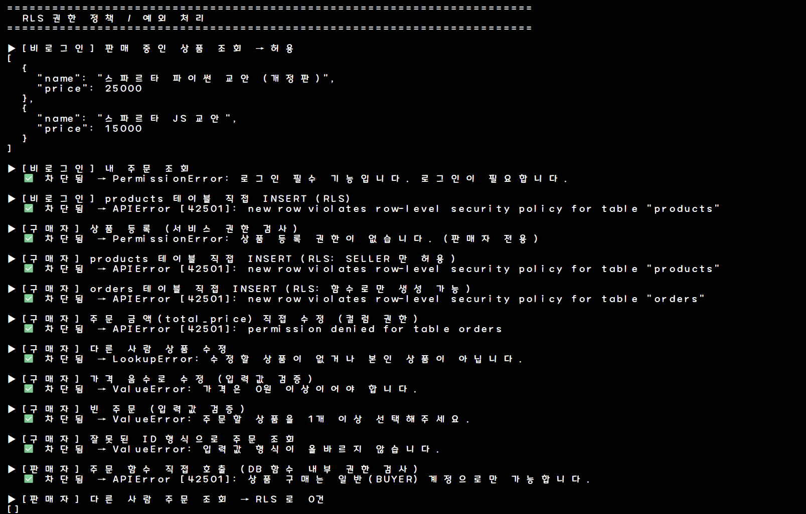

# 🛒 Python 쇼핑몰 데이터베이스 프로젝트

Python(uv) + Supabase(PostgreSQL)로 **회원 · 상품 · 주문** 테이블의 CRUD, 트랜잭션 기반 주문 처리, RLS 권한 정책을 구현했습니다.

```bash
uv sync                           # 가상환경 생성 + 의존성 설치
cp .env.sample .env               # SUPABASE_URL, SUPABASE_ANON_KEY 입력
# Supabase SQL Editor에서 sql/01_schema.sql → 02_functions.sql → 03_rls.sql 순서로 실행
uv run python -m src.demo         # 전체 시연 (user | product | order | tx | rls 로 개별 실행 가능)
```

---

## 데이터베이스 설계

### ERD



### 회원 — `auth.users` + `user_details`

로그인 계정(이메일·비밀번호)은 Supabase Auth의 `auth.users`가 관리하고, 쇼핑몰 정보는 `user_details`에 1:1로 저장합니다.

| 컬럼 | 타입 | 키 | 제약조건 | 설명 |
| --- | --- | --- | --- | --- |
| id | uuid | **PK, FK** | → `auth.users(id)` on delete cascade | 회원 ID |
| type | text | | NOT NULL, `BUYER` / `SELLER` | 회원 유형 (기본 BUYER) |
| cellphone | text | | NOT NULL | 휴대폰 번호 |
| zipcode / address | text | | NOT NULL | 우편번호 / 주소 |
| address_sub | text | | | 상세 주소 |
| created_at / modified_at / deleted_at | timestamptz | | created_at NOT NULL | 생성 / 수정 / 탈퇴일 |

### 상품 — `products`

| 컬럼 | 타입 | 키 | 제약조건 | 설명 |
| --- | --- | --- | --- | --- |
| id | uuid | **PK** | default gen_random_uuid() | 상품 ID |
| seller_id | uuid | **FK** | → `auth.users(id)` | 판매자 ID |
| name | text | | NOT NULL | 상품명 |
| description | text | | | 상품 설명 |
| price | int | | NOT NULL, `>= 0` | 가격 |
| created_at / modified_at / deleted_at | timestamptz | | created_at NOT NULL | 등록 / 수정 / 삭제일 |


> Supabase Table Editor: `id`의 🔑 표시가 PK, `seller_id`의 🔗 표시가 FK

### 주문 — `orders`

| 컬럼 | 타입 | 키 | 제약조건 | 설명 |
| --- | --- | --- | --- | --- |
| id | uuid | **PK** | default gen_random_uuid() | 주문 ID |
| order_no | text | **UK** | NOT NULL, UNIQUE | 주문번호 |
| user_id | uuid | **FK** | → `auth.users(id)` | 주문 회원 ID |
| order_name / order_email / order_phone | text | | NOT NULL | 주문자 정보 |
| receiver_name / receiver_phone | text | | NOT NULL | 수령인 정보 |
| zipcode / address | text | | NOT NULL | 배송지 |
| address_sub / delivery_memo | text | | | 상세 주소 / 배송 메모 |
| total_price | int | | NOT NULL, `>= 0` | 총 금액 |
| order_status | text | | NOT NULL, 상태값 CHECK | READY · ORDER · IN_CASH · PREPARE · ON_DELIVERY · DONE_DELIVERY · CANCELED |
| created_at / modified_at / deleted_at | timestamptz | | created_at NOT NULL | 생성 / 수정 / 취소일 |

### 주문 상품 — `order_items`

`orders`와 `products`의 N:M 관계를 풀어주는 연결 테이블입니다.

| 컬럼 | 타입 | 키 | 제약조건 | 설명 |
| --- | --- | --- | --- | --- |
| id | uuid | **PK** | default gen_random_uuid() | 주문 상품 ID |
| order_id | uuid | **FK** | → `orders(id)` | 주문 ID |
| product_id | uuid | **FK** | → `products(id)` | 상품 ID |
| item_name | text | | NOT NULL | 주문 시점 상품명 |
| price | int | | NOT NULL, `>= 0` | 주문 시점 단가 |
| quantity | int | | NOT NULL, `>= 1` | 수량 |
| created_at / modified_at / deleted_at | timestamptz | | created_at NOT NULL | 생성 / 수정 / 취소일 |

- `(order_id, product_id)` UNIQUE로 한 주문에 같은 상품 중복 방지

### 정규화 · Naming 규칙

- **정규화**: 로그인 정보는 `auth.users`, 회원 정보는 `user_details`, 상품 정보는 `products`에만 저장하고, 주문 상품은 `order_items` 행으로 분리
- **의도적 스냅샷**: 주문의 배송지와 `order_items`의 상품명·단가는 주문 시점 값을 복사해 둠. 이후 회원 주소나 상품 가격이 바뀌어도 과거 주문은 그대로 유지
- **Soft Delete**: 주문이 상품을 FK로 참조하므로 행을 지우지 않고 `deleted_at`에 삭제 시각을 기록
- **Naming**: 테이블·컬럼은 snake_case(테이블은 복수형), FK 컬럼은 `<대상>_id`, 제약조건은 `pk_` / `fk_` / `ck_` / `uq_<table>_<column>`, 인덱스는 `idx_<table>_<column>`

---

## CRUD 동작 화면

### 회원

`sign_up()` · `create_details()` → `get_details()` → `update_details()` → `withdraw()`



### 상품

`add()` → `search()` · `get()` → `update()` → `delete()` (판매자 계정)





### 주문

`order()` → `get_order()` · `get_orders()` → `update_delivery()` → `cancel()` (구매자 계정)





---

## 트랜잭션 정합성 검증

주문 생성(`orders` INSERT → `order_items` INSERT N건 → `total_price` UPDATE)과 주문 취소를 각각 DB 함수 하나(`create_order_transaction`, `cancel_order`)로 묶어 단일 트랜잭션으로 처리합니다. 함수가 끝까지 성공하면 COMMIT, 중간에 예외가 나면 앞서 INSERT 된 행까지 모두 ROLLBACK 됩니다.

아래는 정상 주문(COMMIT) 후, **정상 상품 + 존재하지 않는 상품**으로 주문해 실패시킨 결과입니다. 실패 전후 주문 건수가 같아 부분 저장이 없음을 확인할 수 있습니다. SQL 레벨 재현은 `sql/04_transaction_test.sql`에 있습니다.



---

## RLS 권한 정책 및 예외 처리

| 테이블 | SELECT | INSERT | UPDATE | DELETE |
| --- | --- | --- | --- | --- |
| user_details | 본인 | 본인 | 본인 | ✕ (soft delete) |
| products | 누구나 (판매 중) + 본인 상품 | SELLER 본인 | 본인 상품 | ✕ (soft delete) |
| orders | 본인 | ✕ (함수로만 생성) | 본인 · READY 상태 · 배송 정보 컬럼만 | ✕ (함수로만 취소) |
| order_items | 본인 주문 | ✕ (함수로만 생성) | ✕ | ✕ |

- `orders.total_price`, `order_status`는 컬럼 권한으로 클라이언트 수정 차단
- 트랜잭션 함수는 사용자 ID를 파라미터로 받지 않고 `auth.uid()`로 확인하며, 함수 안에서 BUYER 권한을 검사
- PostgreSQL 에러 코드(23502, 23503, 23514, 22P02, 42501, P0001 등)를 `BaseService.to_app_error()`에서 `ValueError` / `PermissionError` 등 의미 있는 예외로 변환


