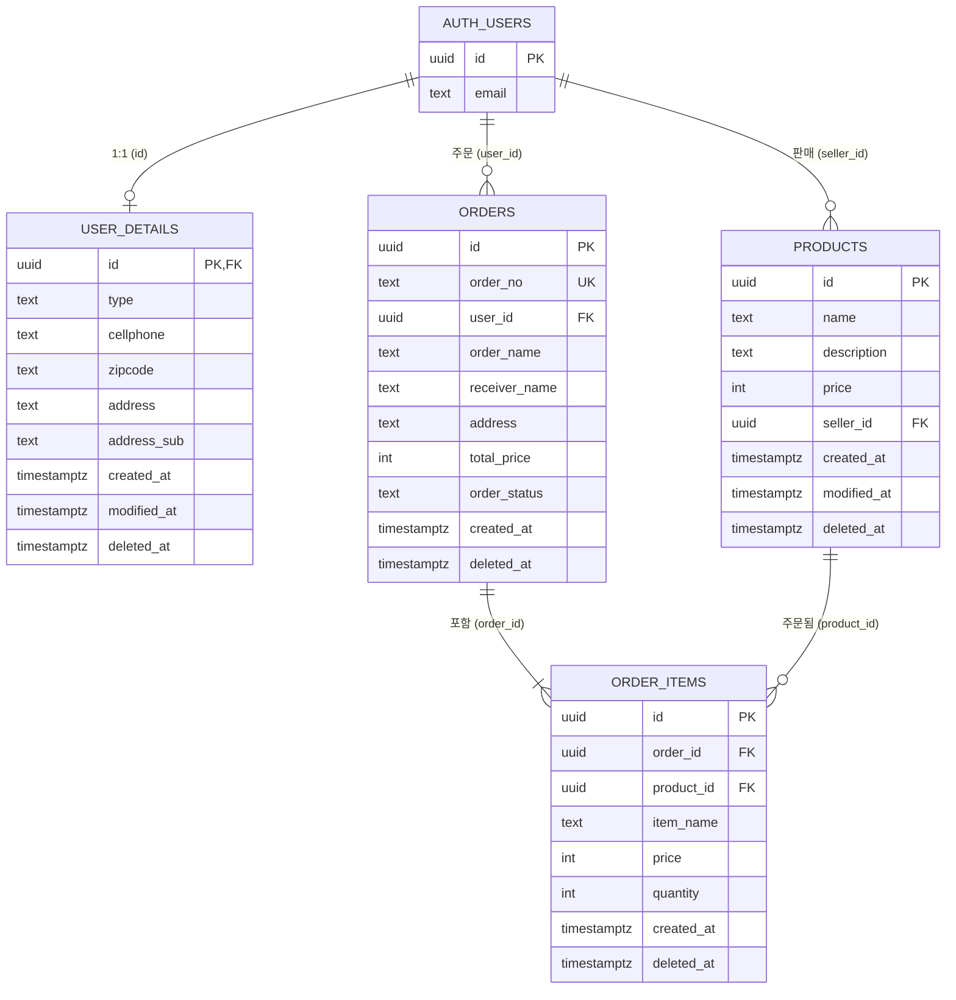
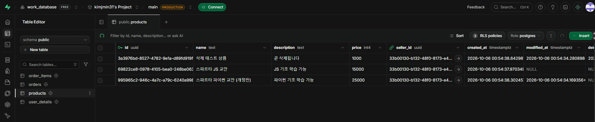

# 🛒 Python 쇼핑몰 데이터베이스 프로젝트

Python + Supabase(PostgreSQL)로 구현한 쇼핑몰 백엔드입니다.
**회원 · 상품 · 주문** 테이블의 CRUD, 트랜잭션 기반 주문 처리, RLS 권한 정책을 구현했습니다.

## 목차

1. [기술 스택](#기술-스택)
2. [프로젝트 구조](#프로젝트-구조)
3. [실행 방법](#실행-방법)
4. [데이터베이스 설계](#데이터베이스-설계)
5. [CRUD 동작 화면](#crud-동작-화면)
6. [트랜잭션 정합성 검증](#트랜잭션-정합성-검증)
7. [RLS 권한 정책 및 예외 처리](#rls-권한-정책-및-예외-처리)

---

## 기술 스택

| 구분 | 사용 기술 |
| --- | --- |
| Language | Python 3.13 |
| 패키지 관리 | uv |
| Database | Supabase (PostgreSQL) |
| SDK | supabase-py 2.31 |
| 코드 스타일 | Ruff (기본 규칙) |

## 프로젝트 구조

```
.
├── sql/
│   ├── 01_schema.sql             # 테이블 · 제약조건 · 인덱스
│   ├── 02_functions.sql          # 주문 생성 / 취소 트랜잭션 함수
│   ├── 03_rls.sql                # RLS 정책 · 컬럼 권한
│   └── 04_transaction_test.sql   # COMMIT / ROLLBACK 재현 스크립트
├── src/
│   ├── main.py                   # Supabase 클라이언트 생성
│   ├── demo.py                   # CRUD · 트랜잭션 · RLS 시연 스크립트
│   ├── services/
│   │   ├── base_service.py       # 공통 기능 · 에러 코드 변환
│   │   ├── user_service.py       # 회원 CRUD
│   │   ├── product_service.py    # 상품 CRUD
│   │   └── order_service.py      # 주문 CRUD
│   └── utils/time.py
├── docs/images/                  # README 캡처 이미지
├── .env.sample
├── pyproject.toml
└── uv.lock
```

## 실행 방법

### 1. 환경 구성

```bash
uv sync                     # .venv 가상환경 생성 + 의존성 설치
cp .env.sample .env         # Supabase URL, ANON KEY 입력
```

```
SUPABASE_URL=
SUPABASE_PUBLISHABLE_KEY=
SUPABASE_ANON_KEY=
```

### 2. Supabase 설정

1. Supabase 대시보드 **SQL Editor**에서 `sql/01_schema.sql` → `02_functions.sql` → `03_rls.sql` 순서로 실행
2. **Authentication > Sign In / Providers > Email**에서 `Confirm email` 비활성화 (테스트 계정 즉시 로그인용)

### 3. 실행

```bash
uv run python -m src.main          # 연결 확인
uv run python -m src.demo          # 전체 시연
uv run python -m src.demo user     # 회원 CRUD
uv run python -m src.demo product  # 상품 CRUD
uv run python -m src.demo order    # 주문 CRUD
uv run python -m src.demo tx       # 트랜잭션 검증
uv run python -m src.demo rls      # RLS · 예외 처리 검증
```

---

## 데이터베이스 설계

### ERD




> Supabase **Database > Schema Visualizer** 화면

### 테이블 상세

#### 회원 — `auth.users` + `user_details`

로그인 계정(이메일·비밀번호)은 Supabase Auth의 `auth.users`가 관리하고, 쇼핑몰에 필요한 추가 정보는 `user_details`에 1:1로 저장합니다.

| 컬럼 | 타입 | 키 | 제약조건 | 설명 |
| --- | --- | --- | --- | --- |
| id | uuid | **PK, FK** | `auth.users(id)` on delete cascade | 회원 ID |
| type | text | | NOT NULL, `BUYER` / `SELLER` | 회원 유형 (기본값 BUYER) |
| cellphone | text | | NOT NULL | 휴대폰 번호 |
| zipcode | text | | NOT NULL | 우편번호 |
| address | text | | NOT NULL | 주소 |
| address_sub | text | | | 상세 주소 |
| created_at | timestamptz | | NOT NULL, default now() | 생성일 |
| modified_at | timestamptz | | | 수정일 |
| deleted_at | timestamptz | | | 탈퇴일 (soft delete) |

#### 상품 — `products`

| 컬럼 | 타입 | 키 | 제약조건 | 설명 |
| --- | --- | --- | --- | --- |
| id | uuid | **PK** | default gen_random_uuid() | 상품 ID |
| name | text | | NOT NULL | 상품명 |
| description | text | | | 상품 설명 |
| price | int | | NOT NULL, `>= 0` | 가격 |
| seller_id | uuid | **FK** | `auth.users(id)` | 판매자 ID |
| created_at | timestamptz | | NOT NULL, default now() | 등록일 |
| modified_at | timestamptz | | | 수정일 |
| deleted_at | timestamptz | | | 삭제일 (soft delete) |

#### 주문 — `orders`

| 컬럼 | 타입 | 키 | 제약조건 | 설명 |
| --- | --- | --- | --- | --- |
| id | uuid | **PK** | default gen_random_uuid() | 주문 ID |
| order_no | text | **UK** | NOT NULL, UNIQUE | 주문번호 (YYYYMMDDHH24MISSMS) |
| user_id | uuid | **FK** | `auth.users(id)` | 주문 회원 ID |
| order_name / order_email / order_phone | text | | NOT NULL | 주문자 정보 (주문 시점 스냅샷) |
| receiver_name / receiver_phone | text | | NOT NULL | 수령인 정보 |
| zipcode / address | text | | NOT NULL | 배송지 |
| address_sub / delivery_memo | text | | | 상세 주소 / 배송 메모 |
| total_price | int | | NOT NULL, `>= 0` | 총 결제 금액 |
| order_status | text | | NOT NULL, 상태값 CHECK | READY · ORDER · IN_CASH · PREPARE · ON_DELIVERY · DONE_DELIVERY · CANCELED |
| created_at / modified_at / deleted_at | timestamptz | | | 생성 / 수정 / 취소일 |

#### 주문 상품 — `order_items`

`orders`와 `products`의 N:M 관계를 풀어주는 연결 테이블입니다.

| 컬럼 | 타입 | 키 | 제약조건 | 설명 |
| --- | --- | --- | --- | --- |
| id | uuid | **PK** | default gen_random_uuid() | 주문 상품 ID |
| order_id | uuid | **FK** | `orders(id)` | 주문 ID |
| product_id | uuid | **FK** | `products(id)` | 상품 ID |
| item_name | text | | NOT NULL | 주문 시점 상품명 |
| price | int | | NOT NULL, `>= 0` | 주문 시점 단가 |
| quantity | int | | NOT NULL, `>= 1` | 수량 |
| created_at / modified_at / deleted_at | timestamptz | | | 생성 / 수정 / 취소일 |

- `(order_id, product_id)` UNIQUE: 한 주문에 같은 상품이 중복으로 들어가지 않도록 보장

### 정규화

- **1NF**: 모든 컬럼은 단일 값. 주문 상품은 배열이 아닌 `order_items` 행으로 분리
- **2NF / 3NF**: 상품 정보는 `products`, 회원 정보는 `user_details`, 로그인 정보는 `auth.users`에만 저장
- **의도적인 비정규화 (스냅샷)**: `orders`의 주문자·배송지, `order_items`의 `item_name`·`price`는 **주문 시점의 값**입니다. 회원이 주소를 바꾸거나 판매자가 가격을 바꿔도 과거 주문 내역은 변하면 안 되므로 복사해 둡니다.

### Naming Convention

| 대상 | 규칙 | 예시 |
| --- | --- | --- |
| 테이블 | snake_case 복수형 | `products`, `order_items` |
| 컬럼 | snake_case | `seller_id`, `created_at` |
| FK 컬럼 | `<참조대상 단수형>_id` | `order_id`, `product_id` |
| PK 제약 | `pk_<table>` | `pk_orders` |
| FK 제약 | `fk_<table>_<column>` | `fk_order_items_order_id` |
| CHECK 제약 | `ck_<table>_<column>` | `ck_products_price` |
| UNIQUE 제약 | `uq_<table>_<column>` | `uq_orders_order_no` |
| 인덱스 | `idx_<table>_<column>` | `idx_orders_user_id` |
| 함수 | `<동사>_<대상>` | `create_order_transaction`, `cancel_order` |
| 공통 컬럼 | 생성 / 수정 / 삭제 | `created_at`, `modified_at`, `deleted_at` |

### 삭제 정책 (Soft Delete)

`order_items`가 `products`를 FK로 참조하므로 상품을 물리적으로 지우면 과거 주문이 깨집니다. 따라서 모든 테이블은 `deleted_at`에 삭제 시각을 기록하고, 조회 시 `deleted_at is null` 조건으로 제외합니다.

---

## CRUD 동작 화면

각 동작은 **실행 결과(터미널)** 와 **Supabase Table Editor의 실제 데이터 변화**를 함께 첨부했습니다.

### 회원 (`uv run python -m src.demo user`)

| 동작 | 메서드 | 설명 |
| --- | --- | --- |
| Create | `sign_up()`, `create_details()` | 회원가입 → 상세 정보 등록 |
| Read | `get_details()` | 내 정보 조회 |
| Update | `update_details()` | 휴대폰·주소 수정 |
| Delete | `withdraw()` | 회원 탈퇴 (soft delete) |


### 상품 (`uv run python -m src.demo product`)

| 동작 | 메서드 | 설명 |
| --- | --- | --- |
| Create | `add()` | 상품 등록 (판매자 전용) |
| Read | `search()`, `get()` | 목록 · 키워드 검색 · 단건 조회 |
| Update | `update()` | 상품명·가격 수정 (본인 상품만) |
| Delete | `delete()` | 상품 삭제 (soft delete) |




### 주문 (`uv run python -m src.demo order`)

| 동작 | 메서드 | 설명 |
| --- | --- | --- |
| Create | `order()` | 주문 생성 (orders + order_items, 단일 트랜잭션) |
| Read | `get_orders()`, `get_order()` | 내 주문 목록 · 상세 (주문 상품 포함) |
| Update | `update_delivery()` | 배송 정보 수정 (결제 전 주문만) |
| Delete | `cancel()` | 주문 취소 (orders + order_items soft delete, 단일 트랜잭션) |


---

## 트랜잭션 정합성 검증

주문 생성은 `orders` INSERT → `order_items` INSERT(N건) → `total_price` UPDATE 세 단계로 이루어집니다.
중간에 하나라도 실패하면 일부만 저장되는 일이 없도록 DB 함수 `create_order_transaction` 하나로 묶었습니다.
Supabase는 RPC 호출 1건을 하나의 트랜잭션으로 실행하므로, 함수가 끝까지 성공하면 **COMMIT**, 예외가 발생하면 **ROLLBACK** 됩니다.

| 시나리오 | 입력 | 결과 |
| --- | --- | --- |
| 정상 주문 | 유효한 상품 | COMMIT → orders +1, order_items +N |
| 상품 오류 | 정상 상품 + 삭제된 상품 | 예외 → 먼저 INSERT 된 행까지 ROLLBACK |
| 수량 오류 | 수량 0 | 예외 → ROLLBACK |
| 권한 오류 | 판매자 계정으로 주문 | 예외 → ROLLBACK |

### Python 실행 결과 (`uv run python -m src.demo tx`)


### SQL Editor 재현 (`sql/04_transaction_test.sql`)


---

## RLS 권한 정책 및 예외 처리

### RLS 정책

모든 테이블에 RLS를 활성화했고, 정책이 없는 동작은 기본적으로 거부됩니다.

| 테이블 | SELECT | INSERT | UPDATE | DELETE |
| --- | --- | --- | --- | --- |
| user_details | 본인 | 본인 | 본인 | ✕ (soft delete) |
| products | 누구나 (판매 중) + 본인 상품 | SELLER 본인 | 본인 상품 | ✕ (soft delete) |
| orders | 본인 | ✕ (함수로만 생성) | 본인 · READY 상태 · 배송 정보 컬럼만 | ✕ (함수로만 취소) |
| order_items | 본인 주문 | ✕ (함수로만 생성) | ✕ | ✕ |

- `orders`의 `total_price`, `order_status`는 컬럼 권한(`grant update (...)`)으로 클라이언트 수정을 차단
- 트랜잭션 함수는 `security definer`로 RLS를 우회하므로, 사용자 ID를 파라미터로 받지 않고 `auth.uid()`로 직접 확인하며 함수 안에서 BUYER 권한을 검사

### 예외 처리

PostgreSQL 에러 코드를 `BaseService.to_app_error()`에서 파이썬 예외로 변환합니다.

| 코드 | 원인 | 변환 |
| --- | --- | --- |
| 23502 | NOT NULL 위반 | `ValueError` |
| 23503 | FK 위반 | `ValueError` |
| 23505 | UNIQUE 위반 | `ValueError` |
| 23514 | CHECK 위반 | `ValueError` |
| 22P02 | 잘못된 형식 (uuid 등) | `ValueError` |
| 42501 | RLS 위반 · 권한 없음 | `PermissionError` |
| P0001 | DB 함수의 `raise exception` | `ValueError` (함수 메시지 그대로) |
| 그 외 | | `RuntimeError` |

### 실행 결과 (`uv run python -m src.demo rls`)


> Supabase **Authentication > Policies** 화면
